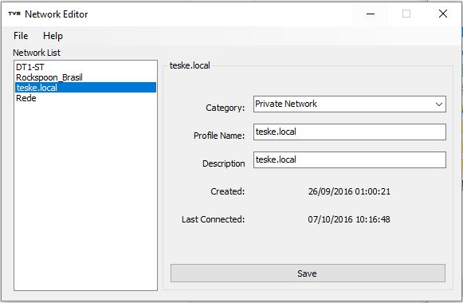

Network Editor
========================================

)

A simple Windows Network Profile Renamer / Category Changer. The latest versions of windows not always allow you to change the Network Profile Name and the Network Category (Public, Private or Domain). With this program you can directly edit them from windows registry. Have fun :D

